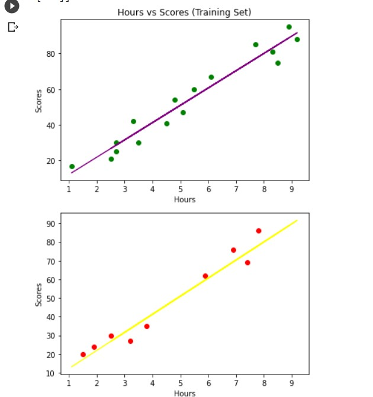

# Implementation-of-Simple-Linear-Regression-Model-for-Predicting-the-Marks-Scored

## AIM:
To write a program to implement the simple linear regression model for predicting the marks scored.

## Equipments Required:
1. Hardware – PCs
2. Anaconda – Python 3.7 Installation / Moodle-Code Runner

## Algorithm
1. Import the standard libraries .
2. Set variables for assigning dataset values .
3. Import linear regression from sklearn .
4. Assign the points for representing in the graph .
5. Predict the regression for marks by using the representation of the graph .
6. Compare the graphs and hence we obtained the linear regression for the given datas .

## Program:
```
/*
Program to implement the simple linear regression model for predicting the marks scored.
Developed by: Kiran J
RegisterNumber: 212221240022 

import numpy as np
import pandas as pd
import matplotlib.pyplot as plt
dataset = pd.read_csv('student_scores.csv')
dataset.head()
X=dataset.iloc[:,:-1].values

Y=dataset.iloc[:,1].values


from sklearn.model_selection import train_test_split
X_train,X_test,Y_train,Y_test = train_test_split(X,Y,test_size = 1/3,random_state = 0)
from sklearn.linear_model import LinearRegression
regressor = LinearRegression()
regressor.fit(X_train,Y_train)
Y_pred = regressor.predict(X_test)
plt.scatter(X_train,Y_train,color="green")
plt.plot(X_train,regressor.predict(X_train),color="purple")
plt.title("Hours vs Scores (Training Set)")
plt.xlabel("Hours")
plt.ylabel("Scores")
plt.show()
plt.scatter(X_test,Y_test,color="red")
plt.plot(X_train,regressor.predict(X_train),color="yellow") 
plt.xlabel("Hours")
plt.ylabel("Scores")
plt.show()
*/
```

## Output:



## Result:
Thus the program to implement the simple linear regression model for predicting the marks scored is written and verified using python programming.
